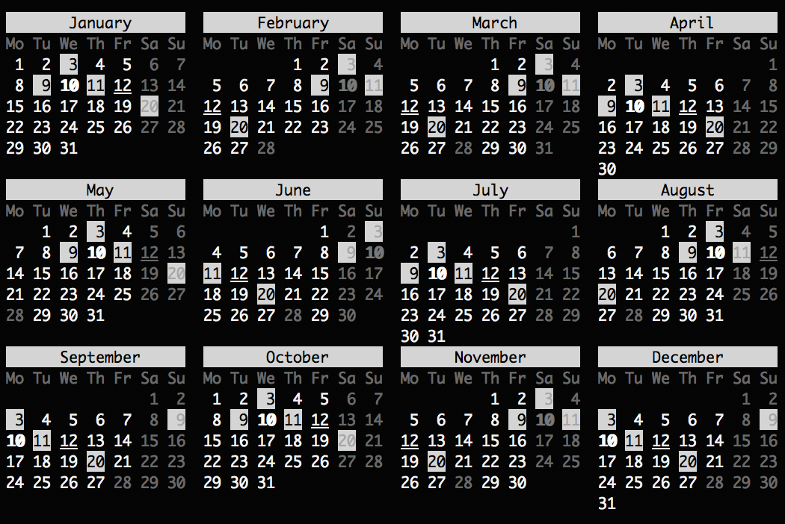

# monthly [](https://travis-ci.com/WebReflection/monthly) [](https://coveralls.io/github/WebReflection/monthly?branch=master) [](https://opensource.org/licenses/ISC)

A simplified way to show a calendar month in any console.

### API / Signature

The exported module is a function that accepts an object with the following properties:

  * `date`: the _mandatory_ date object to use in order to display the month
  * `startDay`: the _optional_ day of the week to use as starting day, by default it's `1` ([Monday](https://github.com/WebReflection/monthly#about-days))
  * `freeDay`: one or more _optional_ days of the week to consider free, by default `[0, 6]` ([Sunday](https://github.com/WebReflection/monthly#about-days), [Saturday](https://github.com/WebReflection/monthly#about-days))
  * `locale`: the _optional_ locale to use, by default `en`
  * `table`: an _optional_ boolean value to indicate the layout should be a proper table, by default it's `false`
  * `year`: an _optional_ boolean value to indicate if the month name should be followed the date year, by default it's `false`
  * `highlight`: an _optional_ day of the month, eventually as list, to highlight. By default it's the current date.
  * `blink`: an _optional_ day of the month, eventually as list, to show blinking, where possible. By default it's an empty list
  * `bold`: an _optional_ day of the month, eventually as list, to show as bold, where possible. By default it's an empty list
  * `dim`: an _optional_ day of the month, eventually as list, to show dimmed, where possible. By default it's an empty list
  * `underline`: an _optional_ day of the month, eventually as list, to show underlined, where possible. By default it's an empty list


### About Days

The `date.getDay()` method returns `0` for _Sunday_, `1` for _Monday_, and all other days 'till `6` for _Saturday_.

Both `startDay` and `freeDay` use this numeric convention for days of the week, but every other property uses the actual day of the month, which is never `0` or greater than `31`.

You can also pass just dates objects for every other field that is not `startDay` or `freeDay`, the function will convert those automatically.


### Usage Example

```js
// import monthly from 'monthly';
// or ...
var monthly = require('monthly');

var rows = monthly({
  date: new Date,
  startDay: 1,
  freeDay: [0, 6],
  locale: 'en',
  highlight: [3, 9, 11, 20],
  blink: 9,
  bold: 10,
  dim: 28,
  underline: 12,
  table: false,
  year: false
});

console.log(rows.join('\n'));
```

Please note the function returns an array, so that it's possible to stack more months per row as shown via `npm test`.

### As CLI

```
Usage: monthly [options]

Options:

  --holidays <cc>    dim holidays for an ISO 3166 country (de gb it us) and underline if national.
  -m, --month <mm>   display a calendar for the month. (default: 8)
  -y, --year [yyyy]  display a calendar for the whole year. (default: 2018)
  -s, --sunday       display Sunday as the first day of the week.
  -3, --three        display three months spanning the date.
  -v, --version      output the version number
  -h, --help         output usage information
```

Please note the ISO 3166 country must be available in this repository.

If not available, `--holidays` won't have any meaning so please file PRs if you'd like your country vacations listed in here, following this [example file](https://github.com/WebReflection/monthly/blob/master/holidays/.example/index.js), thanks.


### Screenshot


